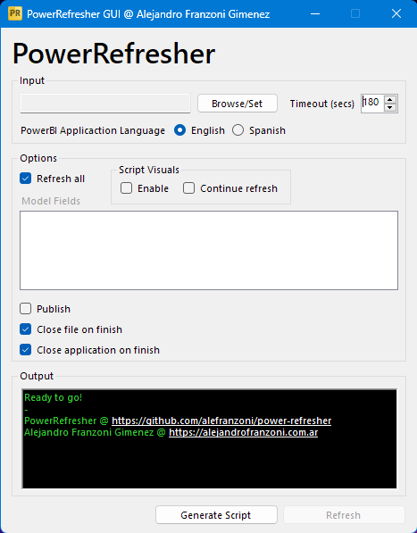
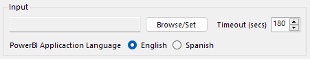
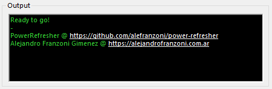
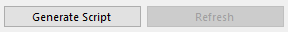

<div id="top"></div>

<!-- PROJECT SHIELDS -->
[![Downloads][downloads-shield]][downloads-url]
[![Forks][forks-shield]][forks-url]
[![Stargazers][stars-shield]][stars-url]
[![Issues][issues-shield]][issues-url]
[![Contributors][contributors-shield]][contributors-url]
[![LinkedIn][linkedin-shield]][linkedin-url]
[![Twitter][twitter-shield]][twitter-url]
[![Donate][donate-shield]][donate-url]

<!-- LOGO/HEADER -->
<br />
<br />
<div align="center">
  <a href="https://github.com/alefranzoni/power-refresher">
    
  </a>

  <h3 align="center">PowerRefresher</h3>

  <p align="center">
    Automate manual updating and publishing of your Power BI Desktop files!
    <br />
    <a href="https://github.com/alefranzoni/power-refresher/issues">Report Bug</a>
    ·
    <a href="https://github.com/alefranzoni/power-refresher/issues">Request Feature</a>
  </p>
</div>

<!-- TABLE OF CONTENTS -->
## Contents
  <ol>
    <li>
      <a href="#about-the-project">About The Project</a>
      <ul>
        <li><a href="#built-with">Built With</a></li>
      </ul>
    </li>
    <li>
      <a href="#usage">Usage</a>
      <ul>
        <li><a href="#gui">GUI</a></li>
      </ul>
      <ul>
        <li><a href="#command-line-arguments">Command Line Arguments</a></li>
      </ul>
    </li>
    <li><a href="#roadmap">Roadmap</a></li>
    <li><a href="#license">License</a></li>
    <li><a href="#contact">Contact</a></li>
  </ol>

<!-- ABOUT -->
## About The Project



**Power Refresher** was developed to automate the manual updating and publishing process of Power BI Desktop files. But, how does the application achieve it? Making use of the **UI Automation** library to catch and manipulate the Power BI Application UI controls to do the desired task.

### Built With
* [UI Automation](https://docs.microsoft.com/en-us/dotnet/framework/ui-automation/ui-automation-overview/)
* [.NET Framework 4.8](https://dotnet.microsoft.com/en-us/download/dotnet-framework/net48/)

<p align="right">(<a href="#top">↑ Top</a>)</p>

<!-- USAGE -->
## Usage
There are two ways to use this tool, directly from its GUI or by passing command line arguments to the executable. Anyway, if you want a full automated process, I recommend using the second option (command line args).

### GUI
Simply, you have to execute the program and set all the options shown in the user interface as you wish, then just press the refresh button to begin the process.

- **Input**
  * Browse/Set: *Press to browse and select the target `*.pbix` file*
  * Timeout: *Set the waiting timeout, in seconds, for file to be opened (max: 600)*
  * Language: *Choose your Power BI Desktop application language* <br><br>
- **Options**
  * Refresh all: *Check to refresh all the queries/tables/fields present on the model. If uncheck this option, you have to select which fields want to be updated from the below list.*
  * Script Visuals
    - Enable: *Check to allow the application to enable script visuals automatically, if they exist in the file. Only enable script visuals if you trust the author and source.*
    - Continue refresh: *Continues with refresh process even if script visuals were disabled. Otherwise, the process will be aborted.*
  * Publish: *Check to publish your file into a workspace after it has been updated. You must put the target workspace name in the box next to the checkbox control.* 
  * Close file on finish: *Check to close `*.pbix` file on process finish*
  * Close application on finish: *Check to close `PowerRefresher` on process finish. If this option is enabled, when the application is closed, a log file will be created and shown with all the update details* <br><br>
- **Output**
  * *Just a simple log console that will show you useful information about the process like information messages, errors, and more* <br><br>
- **Buttons**
  *  Generate Script: *Through this button, you could generate the string to execute the app with command line args, based in your current configuration. Plus, you could generate and save a batch file and just execute it to run the app in a scheduled task, for example*
  *  Refresh: *Start the refresh process* <br><br>

<p align="right">(<a href="#top">↑ Top</a>)</p>

### Command Line Arguments
Run the **PowerRefresher** application by passing the following arguments:

```batchfile
-target=path -timeout=180 -refresh_mode=all/fields -fields="[field1,fieldN]" -publish=bool -workspace=name -enable_script_visuals=bool -sv_force_refresh=bool -closefile=bool -closeapp=bool -pbi_lang=en/es
```
| Command                   | Description                                             |
|---------------------------|---------------------------------------------------------|
|`target`                   |Full pbix file path                                      |
|`timeout`                  |Waiting timeout in seconds (max. 600)                    |
|`refresh_mode`             |Refresh mode, all or selected fields                     |
|`fields`                   |Fields to update                                         |
|`publish`                  |True if you want to publish file                         |
|`workspace`                |Target workspace name (to publish into)                  |
|`enable_script_visuals`    |Allow the app to enable script visuals automatically     |
|`sv_force_refresh`         |Forces refresh process when script visuals are disabled  |
|`closefile`                |True if you want to close file on finish                 |
|`closeapp`                 |True if you want to close app on finish                  |
|`pbi_lang`                 |For English use **en**, for Spanish use **es**           |

#### Example
```batchfile
-target="C:\Users\MyUser\Desktop\My File.pbix" -timeout=180 -refresh_mode=fields -fields="[Table1,Table2]" -publish=true -workspace="My workspace" -enable_script_visuals=false -sv_force_refresh=true -closefile=true -closeapp=true -pbi_lang=en
```

> **Note**: *Remember that you can generate the script from the* `Generate Script` *button.*
<p align="right">(<a href="#top">↑ Top</a>)</p>

<!-- ROADMAP -->
## Roadmap
- [x] Multi-language Support
    - [x] Spanish
- [ ] Migration to WinUI 3

Check the [open issues](https://github.com/alefranzoni/power-refresher/issues) section for a full list of proposed features (and known issues).
<p align="right">(<a href="#top">↑ Top</a>)</p>

<!-- LICENSE -->
## License
Distributed under the MIT License. See `LICENSE.txt` for more information.
<p align="right">(<a href="#top">↑ Top</a>)</p>

<!-- CONTACT -->
## Contact
contacto@alejandrofranzoni.com.ar <br><br>
<p align="right">(<a href="#top">↑ Top</a>)</p>

<!-- DONATE -->
## Donate
You can support me through **Cafecito** (🇦🇷) or **PayPal** (Worldwide). Thank you ❤️
<br/><br/>
[](https://cafecito.app/alefranzoni)
<br/>
<a href="https://www.paypal.com/donate/?hosted_button_id=9LR86UDHEKM3Q" target="_blank"></a>
<p align="right">(<a href="#top">↑ Top</a>)</p>

<!-- MD LINKS & IMAGES -->
[contributors-shield]: https://img.shields.io/github/contributors/alefranzoni/power-refresher
[contributors-url]: https://github.com/alefranzoni/power-refresher/graphs/contributors
[forks-shield]: https://img.shields.io/github/forks/alefranzoni/power-refresher
[forks-url]: https://github.com/alefranzoni/power-refresher/network/members
[stars-shield]: https://img.shields.io/github/stars/alefranzoni/power-refresher
[stars-url]: https://github.com/alefranzoni/power-refresher/stargazers
[issues-shield]: https://img.shields.io/github/issues/alefranzoni/power-refresher
[issues-url]: https://github.com/alefranzoni/power-refresher/issues
[downloads-shield]: https://img.shields.io/github/downloads/alefranzoni/power-refresher/total
[downloads-url]: https://github.com/alefranzoni/power-refresher/releases
[linkedin-shield]: https://img.shields.io/badge/-LinkedIn-blue.svg?logo=linkedin
[linkedin-url]: https://linkedin.com/in/alejandrofranzonig
[twitter-shield]: https://img.shields.io/badge/-Twitter-blue.svg?logo=twitter&logoColor=white
[twitter-url]: https://twitter.com/AleFranzoniDGK
[instagram-shield]: https://img.shields.io/badge/-Instagram-blue.svg?logo=instagram&logoColor=white
[instagram-url]: https://www.instagram.com/alefranzoni/
[donate-shield]: https://img.shields.io/badge/$-donate-ff69b4.svg?maxAge=2592000&amp;style=flat
[donate-url]: https://github.com/alefranzoni/power-refresher#donate

